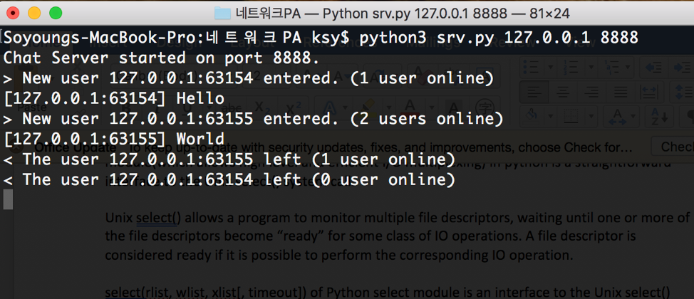

# Multi-user TCP chatting system
## Author: Soyoung Kang  

# Introduction
This is a multi-user real time chatting application based on python language and its select module. I implemented the entire server side code and updated skeleton client code so that the program processes multiple users with a single server by multiplexing.  

# Flow Chart
  

# Snapshots
  
  
  

# Line by line
## Server
  
Firstly, create a welcome socket welcome_sock which sets address as command line argument.  
Then wait for clients using listen(), whilst making a list of connections called conn_list, initializing it to the welcome_sock.  

  
While conn_list is not empty, call select.select() to take client sockets that are ready to connect. For each client socket in ready, create a connection socket conn_sock by calling accept() on welcome_sock if that is newly connecting socket. Add this newly connected conn_sock into conn_list so that the server can keep tabs on what it’s sending.  
Send the connection status including the total number of users online to both incoming client socket and the rest of connected client sockets, as well as printing on the server side terminal.  

  
Otherwise if there already exists a connection socket for this socket in the loop, receive data from it. Make sure to propagate the received data to other clients online since this is a real time multi-user chat application.  

  
Disconnect the connection if the client types in invalid message such as keyboard interruption or blank. Remove the connection socket from conn_list and close it.  

  
Catch KeyboardInterrupt so that the program terminates with Ctrl+C. Close all the existing connection sockets and welcome_socket in this case.  

## Client
  
Create a socket cli_sock that takes a server address as command line argument. Then connect to the server.  

  
Run the loop until the connection disconnects, meaning it keeps detecting transmission between server and itself.  
If the current socket being processed by the server is this very socket(cli_sock), implying the server is sending some message to it, then receive data from the server. The received data will be messages with status information. If there is no data being received, which indicates the server closed the connection, then close the client socket and exit the program.  

  
Otherwise get message as a raw input from user and send it to the server so that the server can propagate this message to other users. If the user enter empty string, then disconnect.  

  
Catch KeyboardInterrupt so that the program terminates with Ctrl+C. Close the socket and exit program.
